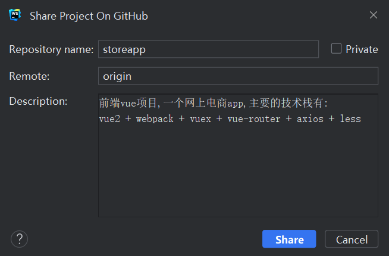

使用webstrom将项目提交至git报错:
`[Repository;description]`custom:
description control characters are not allowed
操作如下:

报错原因:  
翻译下来大概的意思是创建远程仓库失败，
描述中的字符是不允许的，说明应该是描述中出现了非法字符，
因为是用中文写的，所以我尝试换掉中文符号，然后还不行，
后来把回车换行去掉，就可以了，所以github的描述应该是不支持换行的。

解决:  
去掉描述框中的回车即可.

package.json文件中配置scripts为:
"serve": "vue-cli-service serve --open",
则使用npm run serve时会自动打开浏览器